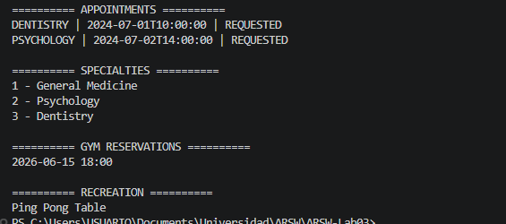

# Descomposición de Bienestar Universitario — Microservicios gRPC

## Resumen

Se descompuso el sistema monolítico de bienestar universitario de la Parte 4 en cuatro microservicios gRPC independientes, cada uno con su propio archivo `.proto`, su propio servidor y su propio puerto. Un cliente único (`WelfareClient`) abre un canal hacia cada servicio y consume todos en secuencia.

La separación se guió por el principio de responsabilidad única: cada servicio gestiona un dominio distinto del bienestar universitario y no conoce los detalles internos de los demás.

---

## Diagrama de microservicios

```
                        WelfareClient
                             |
          +------------------+------------------+------------------+
          |                  |                  |                  |
    localhost:50051    localhost:50052    localhost:50053    localhost:50054
          |                  |                  |                  |
 AppointmentService   MedicalService       GymService     RecreationService
  (citas médicas)    (especialidades)  (sesiones gym)   (recursos recreativos)
```

Cada servicio es autónomo: tiene su propio proceso, su propio proto y su propio estado en memoria.

---

## Responsabilidad de cada servicio

| Servicio | Puerto | Responsabilidad | Datos propios |
|---|---|---|---|
| `AppointmentService` | 50051 | Gestionar solicitud, cancelación y consulta de citas de atención | Citas con estado (REQUESTED / CANCELLED / ATTENDED) |
| `MedicalService` | 50052 | Exponer las especialidades médicas disponibles en bienestar | Catálogo de especialidades (id, nombre) |
| `GymService` | 50053 | Gestionar reservas de sesiones de gimnasio por estudiante | Reservas con fecha y hora |
| `RecreationService` | 50054 | Gestionar préstamo o reserva de recursos recreativos | Reservas de recursos (ej. mesa de ping pong) |

---

## Contratos (.proto)

| Archivo | Servicio | RPCs |
|---|---|---|
| `appointment.proto` | `AppointmentService` | `RequestAppointment`, `CancelAppointment`, `GetAppointments` |
| `medical.proto` | `MedicalService` | `GetSpecialties` |
| `gym.proto` | `GymService` | `ReserveSession`, `GetGymReservations` |
| `recreation.proto` | `RecreationService` | `ReserveResource`, `GetRecreationReservations` |

---

## Cómo ejecutar

```bash
# Compilar todo
mvn compile
```

Abrir una terminal por servicio y una adicional para el cliente:

```bash
# Terminal 1 — AppointmentService (puerto 50051)
mvn exec:java -Dexec.mainClass="edu.eci.arsw.welfare.appointment.AppointmentGrpcServer1"

# Terminal 2 — MedicalService (puerto 50052)
mvn exec:java -Dexec.mainClass="edu.eci.arsw.welfare.medical.MedicalGrpcServer"

# Terminal 3 — GymService (puerto 50053)
mvn exec:java -Dexec.mainClass="edu.eci.arsw.welfare.gym.GymGrpcServer"

# Terminal 4 — RecreationService (puerto 50054)
mvn exec:java -Dexec.mainClass="edu.eci.arsw.welfare.recreation.RecreationGrpcServer"

# Terminal 5 — Cliente (requiere los 4 servicios activos)
mvn exec:java -Dexec.mainClass="edu.eci.arsw.welfare.WelfareClient"
```

---



## Cumplimiento de requisitos

| Requisito | Estado |
|---|---|
| Diagrama de microservicios | Cumplido |
| Descripción de responsabilidad de cada servicio | Cumplido |
| Al menos dos servicios implementados en puertos distintos | Cumplido — los 4 servicios implementados |
| Cliente que consuma directamente los servicios | Cumplido — `WelfareClient` con 4 canales independientes |
| Cada servicio con su propio `.proto` | Cumplido |
| Datos en memoria por servicio | Cumplido |

---

## Reflexión y conclusiones

### ¿Por qué decidió separar esos servicios y no otros?

La separación se hizo por dominio de negocio: citas médicas, información de especialidades, gimnasio y recreación son áreas con datos y reglas distintas que cambian por razones diferentes. `AppointmentService` concentra el ciclo de vida de las citas; `MedicalService` es un catálogo de solo lectura; `GymService` y `RecreationService` gestionan reservas de recursos físicos con lógica propia. Mezclar estos dominios en un único servicio obligaría a cambiar el monolito completo cada vez que, por ejemplo, se modifique la lógica de reserva del gimnasio.

### ¿Qué datos pertenecen a cada servicio?

Cada servicio es dueño exclusivo de sus datos y no comparte estado con los demás:

- `AppointmentService` — citas: id, studentId, serviceType, date, status
- `MedicalService` — especialidades: id, name
- `GymService` — reservas de sesiones: reservationId, studentId, date, hour
- `RecreationService` — reservas de recursos: reservationId, studentId, resource

El estudiante es referenciado por `studentId` en todos los servicios, pero ningún servicio gestiona la entidad `Student` completa. En un sistema real habría un servicio separado de identidad/estudiantes del que los demás dependerían.

### ¿Qué riesgo aparece cuando el cliente conoce todos los servicios?

El `WelfareClient` abre cuatro canales a cuatro direcciones y puertos distintos. Esto crea acoplamiento directo entre el cliente y la topología interna del sistema: si un servicio cambia de puerto, si se divide en dos, o si se agrega uno nuevo, el cliente debe actualizarse. En sistemas con muchos clientes o con servicios que escalan dinámicamente, este modelo se vuelve inmanejable. La solución habitual es introducir un **API Gateway** o un mecanismo de descubrimiento de servicios que centralice ese conocimiento y permita al cliente hablar con un único punto de entrada.

---

## Conclusiones

Descomponer el monolito en microservicios hace visible algo que antes estaba oculto: cada dominio tiene datos, reglas y razones de cambio propias. Al separar los servicios se gana independencia de despliegue y claridad arquitectónica, pero aparece un nuevo problema que no existía antes: la coordinación. Cuando todo estaba en un solo proceso, llamar a otro "servicio" era simplemente llamar a un método; ahora implica red, puertos, tiempos de espera y fallos parciales.

El ejercicio también muestra que los microservicios no son una solución gratuita al problema del acoplamiento. El `WelfareClient` sabe dónde vive cada servicio, lo que recrea el acoplamiento en el cliente en lugar de eliminarlo. Esta tensión — separar responsabilidades sin crear acoplamiento en el consumidor — es uno de los problemas centrales que abordan los estilos arquitectónicos que siguen, como API Gateway o service mesh.
