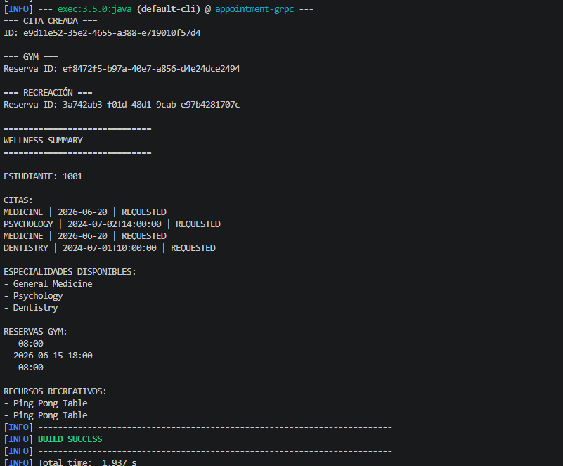

# WellnessGateway — API Gateway sobre microservicios gRPC

## Resumen

Se implementó un **API Gateway** (`WellnessGateway`) que centraliza el acceso a los cuatro microservicios del sistema de bienestar universitario de la Parte 5. El cliente ya no necesita conocer las direcciones ni los puertos individuales de cada servicio; habla únicamente con el gateway, que traduce cada operación de alto nivel hacia los servicios internos correspondientes.

---

## Diagrama de arquitectura

```
         WelfareClient
               |
        WellnessGateway   ← único punto de entrada
         /   |   |   \
        /    |   |    \
  :50051 :50052 :50053 :50054
    |       |      |       |
Appointment Medical  Gym  Recreation
 Service   Service Service  Service
```

El gateway mantiene un canal gRPC permanente hacia cada servicio interno y expone operaciones de negocio compuestas al cliente.

---

## Operaciones del Gateway

| Método | Servicios internos invocados | Descripción |
|---|---|---|
| `requestAppointment(studentId, serviceType, date)` | `AppointmentService` | Solicita una cita médica |
| `reserveGymSession(studentId, timeSlot)` | `GymService` | Reserva una sesión de gimnasio |
| `reserveRecreationResource(studentId, resourceId)` | `RecreationService` | Reserva un recurso recreativo |
| `getStudentWellnessSummary(studentId)` | `AppointmentService` + `MedicalService` + `GymService` + `RecreationService` | Resumen completo del bienestar del estudiante consultando los 4 servicios |

---

## Cómo ejecutar

Desde `Parte6/appointment-grpc/`:

```powershell
mvn compile
```

```powershell
# Terminal 1 — AppointmentService (50051)
mvn exec:java '-Dexec.mainClass=edu.eci.arsw.welfare.appointment.AppointmentGrpcServer1'
```

```powershell
# Terminal 2 — MedicalService (50052)
mvn exec:java '-Dexec.mainClass=edu.eci.arsw.welfare.medical.MedicalGrpcServer'
```

```powershell
# Terminal 3 — GymService (50053)
mvn exec:java '-Dexec.mainClass=edu.eci.arsw.welfare.gym.GymGrpcServer'
```

```powershell
# Terminal 4 — RecreationService (50054)
mvn exec:java '-Dexec.mainClass=edu.eci.arsw.welfare.recreation.RecreationGrpcServer'
```

```powershell
# Terminal 5 — Gateway (cliente)
mvn exec:java '-Dexec.mainClass=edu.eci.arsw.welfare.gateway.WellnessGateway'
```




---

## Cumplimiento de requisitos

| Requisito | Estado |
|---|---|
| Gateway que centraliza acceso a los 4 servicios | Cumplido |
| `requestAppointment(studentId, serviceType)` | Cumplido |
| `getStudentWellnessSummary(studentId)` | Cumplido — consulta los 4 servicios y muestra resumen |
| `reserveGymSession(studentId, timeSlot)` | Cumplido |
| `reserveRecreationResource(studentId, resourceId)` | Cumplido |
| Cliente habla solo con el gateway | Cumplido — `WellnessGateway.main` es el único punto de entrada |

---

## Reflexión y conclusiones

### ¿Qué simplifica el Gateway para el cliente?

El cliente pasa de conocer cuatro direcciones, cuatro puertos y cuatro contratos distintos, a hablar con un único punto de entrada con operaciones de negocio claras. `getStudentWellnessSummary` es el ejemplo más evidente: el cliente hace una sola llamada y el gateway orquesta cuatro servicios internos de forma transparente. Además, si un servicio interno cambia de puerto o se divide en dos, el cliente no necesita actualizarse.

### ¿Qué complejidad agrega al sistema?

El gateway se convierte en un componente central con responsabilidades de orquestación: mantiene cuatro canales abiertos, maneja errores parciales (¿qué pasa si GymService no responde?), y debe actualizarse cada vez que se agrega o modifica un servicio interno. También introduce un nuevo punto de falla único: si el gateway cae, el cliente pierde acceso a todos los servicios aunque estos sigan funcionando. En producción, esto se mitiga con alta disponibilidad y circuit breakers.

### ¿Qué pasaría si el Gateway empieza a contener demasiada lógica de negocio?

El gateway dejaría de ser un enrutador y se convertiría en un monolito disfrazado. Si el gateway valida reglas de negocio, accede directamente a bases de datos o coordina transacciones complejas entre servicios, se convierte en el cuello de botella que la arquitectura de microservicios intentaba evitar. La regla práctica es que el gateway debe saber *a dónde* enrutar las solicitudes, no *qué decisiones* tomar con los datos. La lógica de negocio pertenece a los servicios.

---

## Conclusiones

El gateway resuelve el problema de acoplamiento del cliente que quedó pendiente en la Parte 5: en lugar de que el cliente conozca todos los servicios, ese conocimiento se centraliza en un único componente que actúa como fachada. Esto mejora la experiencia del consumidor y permite que la topología interna de microservicios evolucione sin impactar a los clientes.

Sin embargo, el gateway introduce su propia tensión arquitectónica: centralizar el acceso simplifica al cliente, pero concentra responsabilidades en un solo punto. Cuánta lógica debe vivir en el gateway y cuánta en los servicios es una decisión de diseño que los siguientes estilos arquitectónicos seguirán refinando.
