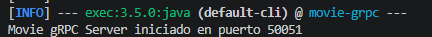
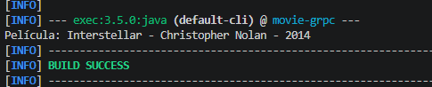

# Taller Integrador de Arquitecturas Distribuidas

Exploración progresiva de estilos arquitectónicos para exponer un repositorio de películas, partiendo de sockets TCP hasta llegar a servicios REST con frameworks modernos.

---

# Parte IV - Comunicación moderna con gRPC

gRPC permite implementar comunicación RPC moderna usando contratos definidos en archivos .proto. A diferencia de RMI, no está limitado a Java; un servicio puede estar escrito en Java y ser consumido por clientes en otros lenguajes. Además, los mensajes son fuertemente tipados y se serializan mediante Protocol Buffers.

---

## Ejecución

Desde `movieExample3/movie-grpc/`:

```powershell
mvn compile
```

Abrir dos terminales:

```powershell
# Terminal 1 - servidor gRPC
mvn exec:java '-Dexec.mainClass=edu.eci.arsw.movie.MovieGrpcServer'
```



```powershell
# Terminal 2 - cliente gRPC
mvn exec:java '-Dexec.mainClass=edu.eci.arsw.movie.MovieGrpcClient'
```


